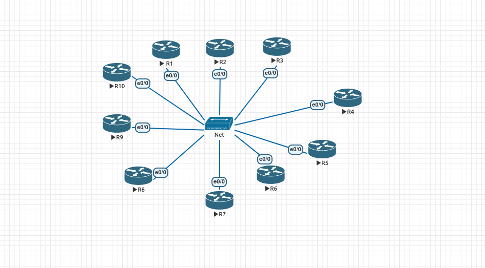

Having purchased CCIE INE workbook, I found it rather tedious to prepare for labs. This tool is my solution on how to quickly delete/load INE configurations, as well as create/load custom topologies into CSR 1000v and IOL platforms.

# Features:
1. quickly create mundane L2, L3 config to reach connectivity;
2. load/delete running-config using telnet;
3. load INE CCIEv5 advanced.technology.labs configurations;
4. conveniently connect to all routers using scripts at auxilary/;

## In-depth overview
### 1. quickly create mundane L2, L3 config to reach connectivity;

Using yaml syntax, defines running-config. 

Supported IP addressing options:
* `loopback`: creates loopback 0 with IP: <`name`.`name`.`name`.`name`>/32.
* `external-loopback`: creates loopback 20 with IP: <20.`name`.`name`.`name`/32>.
* `p2p`: creates gi1 sub-interface with the following IP: <10.0.dot1q.`name`>/24. 
    - dot1q is concated value of `name` and target.
* `external-p2p`: creates gi1 sub-interface with the following IP: <20.0.200+dot1q.`name`>/24.
* `lan`: creates gi1 sub-interface with the following IP: <10.0.`lan`.`name`>/24.

Supported Routing options:
* ospf: enabled per interface in area 0 with statement network <10.0.dot1q.`name`>/0.
* eigrp: enabled per interface with statement network <10.0.dot1q.`name`>/0.
* ibgp: self AS - 1. Neighbor AS 1. Uses `p2p` addressing for neighbor statement.
* ebgp: self AS - `name`. Neighbor AS `ebgp`. Uses `external-p2p` addressing for neighbor statement.
    - there are no checks as to whether the specification you made in yaml is sound bgp-wise.

# yaml syntax
yaml is like json, but it's much more human friendly. Since it can be represented inline (as in below sample) or with new lines, either style works. To see how it would look using new lines, parse the sample in http://www.yamllint.com/.

Below is full sample config of R1:
```yaml
---
- name: 1 # device name. {1-20}. Required. This is the field that's used in all below values, i.e. 2 means device 2.
  loopback: yes # 1.1.1.1
  external_loopback: yes # 20.1.1.1
  p2p: [2] # make gi1.12 subif, with dot1q 12 and ip address 10.0.12.1/24
  external-p2p: [2] # make gi1.212 subif, with dot1q 200+12 and ip address 20.0.12.1/24
  ospf: [loopback,2] # enable ospf on loopback, p2p address 10.0.12.1/0
  eigrp: [loopback,2] # enable eigrp on loopback, p2p address 10.0.12.1/0
  ibgp: [2] # enable iBGP AS 1 to neighbor p2p address 10.0.12.1/0
  ebgp: [2] # enable eBGP AS 1 to neighbor AS 2 p2p-external address 10.0.12.1/0
```
There are various examples in templates directory.

### 2. load/delete running-config using telnet;
Change the following values in the script:
```
IP = '148.251.122.103'  # CHANGE THIS
START_PORT = 2100       # CHANGE THIS
AVAILABLE_DEVICES = 10  # CHANGE THIS
```
My configuration uses port 2100 as base, i.e. R0, so R1 is 2101.
Set AVAILABLE_DEVICES to a number of device instances you have running. If incorrect number is used, there will be connectivity errors when deleting running configurations, but otherwise functionality is not impacted.

### 3. load INE CCIEv5 advanced.technology.labs configurations
Script searches for '/ine.ccie.rsv5.workbook.initial.configs/advanced.technology.labs' within the current directory. 
Must change AVAILABLE_DEVICES number to 20.
INE configs aren't provided by me.
INE configs are parsed if using IOL so GigabitEthernet1 becomes Ethernet0/0. Transparent to the user, just be aware when pasting answers that they'll need to be changed as well.

# Assumptions
## CSR1000v
- GigabitEthernet1 is implied;
- virtual console ports in hypervisor are consistently numbered, i.e. CSR1 - port x, CSR2 - port x+1;
- there is a base startup-config saved as 'nvram:startup-config;
## IOL
- Ethernet0/0 is implied;
- there is a base startup-config saved as 'unix:startup-config. Since eve-ng provides a convenient configuration restore as well, this is added for feature parity, but may otherwise be unused;
- using the following topology:


# Installation
`pip install -r requirements.txt`